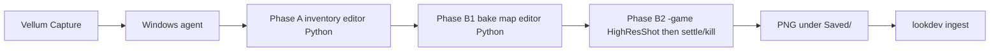

# Unreal capture via Vellum UI (Fireworks)

You stay in **Vellum**. Unreal runs unattended on the Windows box.

## Operator flow

1. On the UE workstation:

```powershell
cd C:\dev\vellum
git pull
pwsh -ExecutionPolicy Bypass -File .\tools\unreal\vellum_ue_agent.ps1
```

2. In Vellum → Fireworks → **Capture from Unreal**
3. Watch **Jobs** (`ue_capture`)
4. Lookdev gains `niagara-render` stills (up to `VELLUM_MAX_SYSTEMS`, default 3)

## Architecture

`UnrealEditor-Cmd -unattended` (editor world) has no reliable live viewport, so
editor HighResShot / editor SceneCapture stills were abandoned.



- **Phase A** — list/pick Niagara systems (`vellum_capture.py`).
- **Phase B1** — bake one system + light + camera into
  `/Game/Vellum/Maps/VellumNiagaraCapture` with Niagara `WarmupTime` so
  particles exist on the first game frame (`vellum_capture_bake_map.py`).
- **Phase B2** — `-game` with `-ExecCmds=HighResShot ...` **without** a
  same-line `quit` (HighResShot is async; quit raced the PNG flush). PowerShell
  waits ~8s then kills the process, then searches `Saved/` for the new image.

Fingerprint to confirm refresh: `game-mode-gui-failfast (2026-07-13)`.

Game stills use **UnrealEditor.exe** (GUI), windowed, **without** `-unattended`.
First missing PNG **fails fast** (no multi-system retry loop) and prints recent
files under `Saved/` so we can see where shots land.

## One-time Windows setup

1. Enable **Python Editor Script Plugin** in `C:\epic\VellumImport`
2. Optional: `$env:VELLUM_UE_CMD = "...\UnrealEditor-Cmd.exe"`
3. Keep `vellum_ue_agent.ps1` running

## What stays human

Humble → Epic redeem / first Add to Project only.

## Troubleshooting

1. **`##PlatformValidate: Linux INVALID`** (and Mac/Android/etc.) during UE
   startup is normal on a Windows-only box. It is **not** the capture script
   importing Linux modules.
2. **`no_png:...:exit=0`** — check `Saved/VellumCapture/ue-game-<n>.log` and
   whether PNGs already exist under `Saved/` (Windows PowerShell `-Include`
   without `\*` often returns empty — runners before
   `game-mode-gui-failfast-filterfix` could miss real screenshots). Live
   heartbeats: `GET /api/jobs/{job_id}/progress`. Current fingerprint:
   `game-mode-wait-png` (wait up to 120s for a real PNG only — do not key off
   `HighResShot` in the log; that string appears in the command-line echo).
3. **`bake_failed` / `bake_no_result`** — see `ue-bake-<n>.log`.
4. Restart the agent after every `git pull`.
5. Chromium `Software\Chromium` result 5 is noise from UE's embedded browser.
6. **`Argument types do not match`** — fixed by switching PNG search off
   `List[object].Add` (PS 5.1) to `ArrayList`.
