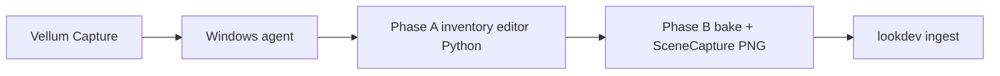

# Unreal capture via Vellum UI (Fireworks)

You stay in **Vellum**. Unreal runs unattended on the Windows box.

## Operator flow

1. On the UE workstation:

```powershell
cd C:\dev\vellum
git pull
pwsh -ExecutionPolicy Bypass -File .\tools\unreal\vellum_ue_agent.ps1
```

2. In Vellum → Fireworks → **Capture from Unreal**
3. Watch **Jobs** (`ue_capture`) or `GET /api/jobs/{id}/progress`
4. Lookdev gains `niagara-render` stills (up to `VELLUM_MAX_SYSTEMS`, default 3)

## Architecture

`-game` HighResShot was abandoned on this box: the game window stayed blank,
map load succeeded, and **zero PNGs** were written after 120s + console inject.
Stills now come from **SceneCapture2D → export_render_target** inside the
editor bake (`vellum_capture_bake_map.py`).



Fingerprint: `editor-scenecapture-noblack (2026-07-13)`.

Pure-black PNGs are rejected (`still_pure_black`). The previous “3 stills
succeeded” run exported 1920×1080 frames with max RGB 0 — not usable Niagara
lookdev.

## One-time Windows setup

1. Enable **Python Editor Script Plugin** in `C:\epic\VellumImport`
2. Optional: `$env:VELLUM_UE_CMD = "...\UnrealEditor-Cmd.exe"`
3. Keep `vellum_ue_agent.ps1` running

## What stays human

Humble → Epic redeem / first Add to Project only.

## Troubleshooting

1. **`##PlatformValidate: Linux INVALID`** during UE startup is normal on Windows.
2. **Blank `-game` window / no_png** — expected with the old game-mode path; current
   runner must say `editor-scenecapture` and must **not** launch a long `-game` wait.
3. **`bake_failed` / `scene_capture_still_failed`** — see `ue-bake-<n>.log` and
   `bake-result.json` notes/errors.
4. Restart the agent after every `git pull`.
5. Chromium `Software\Chromium` result 5 is noise.
6. Live heartbeats: `GET /api/jobs/{job_id}/progress`.
