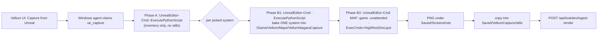

# Unreal capture via Vellum UI (Fireworks)

You stay in **Vellum**. Unreal runs unattended on the Windows box.

## Operator flow

1. On the UE workstation, leave this running in the background (one-time setup below):

```powershell
pwsh -File tools\unreal\vellum_ue_agent.ps1
```

2. In Vellum → Fireworks → **Capture from Unreal**
3. Watch **Jobs** on the detail page (`ue_capture` → succeeded)
4. Lookdev grid gains `niagara-render` stills when capture produces files
   (up to `VELLUM_MAX_SYSTEMS`, default 3 — one still per Niagara system, see
   architecture below)

No navigating Unreal for screenshots. No PowerShell per asset.

## Architecture: why two Unreal phases

`UnrealEditor-Cmd.exe ... -unattended` has no live viewport. We proved this
the hard way: editor `HighResShot` and editor `SceneCapture2D` → render
target → PNG both returned **zero bytes / no file**, even after staging a
blank map, lights, and a framed Niagara actor. That dead end is why the
runner now splits into two Unreal phases:



- **Phase A** (`tools/unreal/vellum_capture.py`) — unchanged inventory scan:
  lists Niagara systems under `-ContentRoot`, picks up to `-MaxSystems`
  candidates, writes `manifest-inventory.json`. No still attempts here.
- **Phase B**, once per picked system:
  1. `tools/unreal/vellum_capture_bake_map.py` (still editor Python, still
     `-ExecutePythonScript`) reads `Saved/VellumCapture/job.json` and bakes
     that **one** system + a dim light + an auto-activating camera into a
     persistent map, `/Game/Vellum/Maps/VellumNiagaraCapture`, then saves it
     to disk.
  2. The runner launches `UnrealEditor-Cmd.exe <uproject> /Game/Vellum/Maps/VellumNiagaraCapture -game -windowed -ResX=1920 -ResY=1080 -unattended -ExecCmds="HighResShot 1920x1080,quit"`.
     `-game` gives a real world tick and a real render loop — the thing
     editor `-unattended` never has — so `HighResShot` actually writes a PNG
     under `Saved/Screenshots/`.
  3. The runner copies the newest PNG into `Saved/VellumCapture/stills/` and
     records it in the merged manifest.

### Why there is no Blueprint / GameMode script, and no manual setup step

The plan's first idea was a `BeginPlay` Blueprint that reads `job.json` at
runtime. We didn't ship that: the stock Python Editor Script Plugin cannot
create or wire Blueprint graph nodes (no `EdGraphPin` exposure to Python —
confirmed against Epic's `unreal.BlueprintEditorLibrary` docs and the
Unreal forums; the only supported node-graph editing needs a third-party
plugin or C++). Authoring that Blueprint by hand would mean a human opening
the Windows Editor GUI every time the capture logic changes, which defeats
the point.

Instead, `vellum_capture_bake_map.py` bakes the *content* of `job.json`
straight into the level while it still has full Editor Python access, using
only plain actor/component **properties** that Unreal already runs natively
with zero custom code:

- `NiagaraComponent.auto_activate = True` → the system starts simulating on
  `BeginPlay` by itself (this is just how Niagara components behave).
- `CameraActor.auto_activate_for_player = PLAYER0` → the engine calls
  `PlayerController.SetViewTarget(this)` on `BeginPlay` by itself (this is
  the literal, documented purpose of that property).

So the capture map is regenerated by tooling on every run — **there is no
one-time "open the Editor and build a Blueprint" step**. The only one-time
Windows setup is enabling the Python plugin (below), same as before.

## One-time Windows setup

1. Enable **Python Editor Script Plugin** in `C:\epic\VellumImport`
2. Have `tools/unreal/*` available on that machine (see re-download below)
3. Optional: `$env:VELLUM_UE_CMD = "C:\Program Files\Epic Games\UE_5.8\Engine\Binaries\Win64\UnrealEditor-Cmd.exe"`
4. Start `vellum_ue_agent.ps1` (Task Scheduler / always-on terminal)

Nothing else — the map, camera, and light are (re)created by
`vellum_capture_bake_map.py` on every capture job.

## Windows script refresh (no `git pull` on that box)

The UE workstation is not set up to `git pull` this repo. Re-download the
three `tools/unreal/*` files straight from GitHub (`AptlyClever/vellum`,
public, `main`) whenever they change:

```powershell
$files = @(
  "tools/unreal/vellum_ue_agent.ps1",
  "tools/unreal/run_vellum_capture.ps1",
  "tools/unreal/vellum_capture.py",
  "tools/unreal/vellum_capture_bake_map.py"
)
foreach ($f in $files) {
  $dest = Join-Path (Resolve-Path ".") $f
  New-Item -ItemType Directory -Force -Path (Split-Path $dest) | Out-Null
  Invoke-WebRequest -Uri "https://raw.githubusercontent.com/AptlyClever/vellum/main/$f" -OutFile $dest
}
Write-Host "Refreshed tools/unreal/* from origin/main"
```

Run that from wherever `tools\unreal\` lives on the Windows box (or adjust
`$dest`), then **restart the agent** — it only reads scripts at process
start:

```powershell
# Ctrl+C the running agent, then:
pwsh -ExecutionPolicy Bypass -File .\tools\unreal\vellum_ue_agent.ps1
```

The agent prints an `Agent fingerprint:` line and a `Runner fingerprint:`
line (parsed from `run_vellum_capture.ps1`'s own `Runner version:` comment)
on startup — if those don't say `game-mode-capture-map (2026-07-13)` /
`game-mode-capture-map`, the re-download or restart didn't take.

## What stays human

Humble → Epic redeem / first Add to Project only.

## APIs (UI uses these)

- `POST /api/ue/capture` — enqueue from UI
- `POST /api/jobs/claim` — agent claims `ue_capture`
- `POST /api/jobs/{id}/report` — agent reports result
- `POST /api/lookdev/ingest-render` — still upload (agent/runner)

## Troubleshooting

1. **Old scripts still running** — job error mentions `enable Python plugin`,
   or the fingerprint lines above don't match → Windows did not re-download
   / restart the agent. After a good refresh, errors say
   `runner=game-mode-capture-map` and include a LogPython snippet.
2. **`\tools` → tab** — path like `vellum       ools` means Unreal ate `\t`.
   The runner stages both Python scripts into
   `Saved/VellumCapture/vellum_capture*.py` and passes config via `VELLUM_*`
   env vars (no `\tools` on the UE command line).
3. **`no_png:<system>` in manifest errors** — the `-game` launch ran but no
   new file showed up under `Saved/Screenshots/`. Check
   `Saved/VellumCapture/ue-game-<slot>.log` for the actual `HighResShot`
   output; common causes are a GPU/driver issue with the render window, or
   the project defaulting to a null RHI in that environment (make sure
   nothing forces `-nullrhi`/software rendering upstream of this script).
4. **`bake_failed` / `bake_no_result` in manifest errors** — check
   `Saved/VellumCapture/ue-bake-<slot>.log`; this is still ordinary editor
   Python (same plugin as inventory), so the usual "enable Python plugin"
   / asset-not-found causes apply.
5. Restart the agent after every refresh:
   `pwsh -ExecutionPolicy Bypass -File .\tools\unreal\vellum_ue_agent.ps1`
