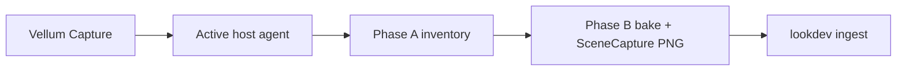

# Unreal capture via Vellum UI (Fireworks)

You stay in **Vellum**. Unreal runs unattended on the Windows box.

## Hosts (profiles)

| Host | Role | UE | Scratch project (default) |
| --- | --- | --- | --- |
| **aurora** | primary (active) | `F:\Games\UE_5.8\…\UnrealEditor.exe` | `F:\Games\AuroraVellum` |
| **borealis** | secondary | `C:\Program Files\Epic Games\UE_5.8\…` | `C:\epic\VellumImport` |

Config: [`config/ue-hosts.json`](../config/ue-hosts.json). API: `GET /api/ue/hosts`.

Only **one** agent should poll at a time. Flip `"active"` in that JSON (or
`-HostName` / `$env:VELLUM_UE_HOST`) when moving machines. Editor.exe paths are
fine — the agent derives `UnrealEditor-Cmd.exe` beside them.

## Operator flow (Aurora)

```powershell
cd E:\Dev\vellum
git pull
pwsh -ExecutionPolicy Bypass -File .\tools\unreal\vellum_ue_agent.ps1
# optional explicit: ... -HostName aurora
```

Preflight should show:

- `Host profile: aurora (Aurora, primary)`
- `Agent fingerprint: ue-hosts (2026-07-13)`
- `Resolved UE Cmd …\UnrealEditor-Cmd.exe` under `F:\Games\UE_5.8\…`

Then Vellum → Fireworks → **Capture from Unreal** (path defaults to active host).

## Switch to Borealis later

1. Stop the Aurora agent.
2. Set `"active": "borealis"` in `config/ue-hosts.json` (commit/pull) **or** run
   `pwsh -File .\tools\unreal\vellum_ue_agent.ps1 -HostName borealis` on Borealis.
3. Start only the Borealis agent.

## Architecture

Stills come from **SceneCapture2D → export_render_target** in the editor bake
(`vellum_capture_bake_map.py`). Fingerprint: `ue-hosts (2026-07-13)`.



Pure-black PNGs are rejected. Borealis smoke proved ingest; particles still need
validation on Aurora — do not treat `stills=3` as lookdev-ready until fireworks
are visible and systems differ.

## One-time per host

1. Fireworks Vol. 1 added to that host’s scratch project
2. **Python Editor Script Plugin** enabled
3. If the scratch `.uproject` is not under the profile `project` path, edit
   `config/ue-hosts.json` for that host (Aurora currently assumes
   `F:\Games\AuroraVellum\AuroraVellum.uproject`)

## Troubleshooting

1. **`UnrealEditor-Cmd.exe not found`** — confirm `F:\Games\UE_5.8\Engine\Binaries\Win64\UnrealEditor-Cmd.exe` exists beside Editor; pull `ue-hosts` agent; check preflight.
2. **Wrong project / Borealis path in job** — agent prefers the active host profile on disk; still set UI path / `ue-hosts.json` project correctly.
3. **`##PlatformValidate: Linux INVALID`** — normal on Windows.
4. Restart the agent after every `git pull`.
5. Live heartbeats: `GET /api/jobs/{job_id}/progress`.
