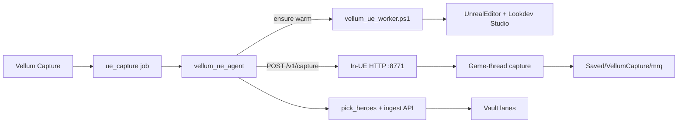

# Vellum Lookdev Worker (Aurora GPU service)

**Status:** active direction (Option 1) — replaces Cmd-per-phase capture  
**Related:** capability fidelity still [`docs/ue-mrq-capture.md`](./ue-mrq-capture.md); this doc is **how Unreal is hosted**  
**Host:** Aurora (`config/ue-hosts.json`)

## Problem

Cold-starting `UnrealEditor-Cmd` for inventory / studio / author / MRQ loads the project’s junk default map, burns minutes, and behaves like a remote E2E harness. Capture should feel like **sending work to a printer**, not unlocking an editor.

## Decision (locked)

**Vellum orchestrates. Aurora runs a warm Unreal lookdev worker.**

| Layer | Owns |
| --- | --- |
| Vellum API / UI | `ue_capture` jobs, vault skip queries, lookdev ingest |
| Windows agent | Claims jobs, keeps worker healthy, posts work, uploads/ingests, reports |
| **UE Lookdev Worker** | Long-lived Unreal Editor on Lookdev Studio; in-process inventory / author / MRQ |

Not: WSL Unreal, Horde farm (yet), SceneCapture screenshots, Cmd-per-phase runner as the primary path.

## Shape



1. Supervisor starts **one** `UnrealEditor.exe` on `/Game/Vellum/Maps/VellumLookdevStudio` and boots the in-UE HTTP server (if not healthy).
2. Agent `POST http://127.0.0.1:8771/v1/capture` with the claimed job payload.
3. Worker runs capture on the **game/editor thread** (HTTP thread only enqueues + waits). Never open the desert default map for work.
4. Frames land under `Saved/VellumCapture/mrq/…`; agent stills/heroes ingest + job report (same vault contract).

## Local protocol (loopback only)

| Method | Path | Purpose |
| --- | --- | --- |
| `GET` | `/health` | `{ ok, version, map, busy, studio_ready }` |
| `POST` | `/v1/ensure_studio` | Build/load Lookdev Studio if missing |
| `POST` | `/v1/capture` | Run pack capture; body = job fields; returns manifest summary |
| `POST` | `/v1/shutdown` | Optional graceful stop of HTTP (editor may stay up) |

Default bind: `127.0.0.1:8771` (`worker_port` on host profile).

## Operator run

### Preferred (no console babysitting)

On Aurora, **once** (Admin PowerShell):

```powershell
cd E:\Dev\vellum
git pull
pwsh -File tools/unreal/host-install/install.ps1 -StartWorkerNow
```

After that: stay logged into Aurora (or use auto-logon). **Only click Capture in Vellum.**  
`host-heal.ps1` (agent before each job + 5‑min watchdog) git-pulls, restages scripts, rebuilds stale Lookdev Studio, and restarts the agent service when code moves.

### Manual (debug only)

```powershell
pwsh -File tools/unreal/vellum_ue_worker.ps1 -Ensure
pwsh -File tools/unreal/vellum_ue_agent.ps1
```

Fingerprint: `lookdev-worker` on agent + worker health `version`.

## Cutover

| Phase | Behavior |
| --- | --- |
| Now | Worker is **primary**. Agent ensures worker, POSTs capture. |
| Fallback | `-LegacyCmdRunner` on agent restores old `run_vellum_capture.ps1` Cmd-per-phase path (debug / disaster only). |

## Out of scope (parking)

- Multi-machine queue / Horde
- Pixel Streaming preview
- Running Unreal under WSL
- Changing MRQ fidelity contract (still Sequencer + Movie Pipeline PNGs)

## Success

Operator clicks Capture. Aurora’s warm editor never reloads desert. Pack completes into vault. No operator digging in UE.
