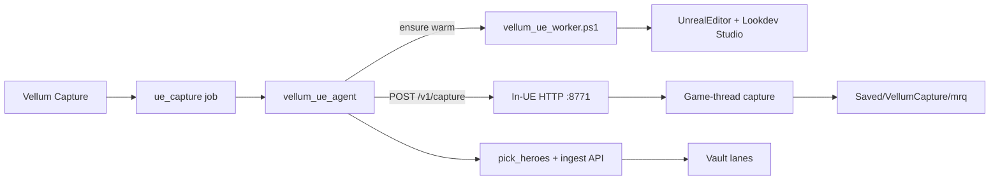

# Vellum Lookdev Worker (Aurora GPU service)

**Status:** **FROZEN** 2026-07-14 — not primary capture  
**Binding decision:** [`docs/capture-hosting-decision.md`](./capture-hosting-decision.md)  
**Primary capture:** Epic batch Cmd (`run_vellum_capture.ps1`) — Epic MRQ command-line pattern  
**Related:** capability fidelity [`docs/ue-mrq-capture.md`](./ue-mrq-capture.md)

> Operator unpark only: `Unpark: Lookdev Worker`. Until then, do not hot-patch worker boot for finish-line packs.

## Why frozen

Warm HTTP + in-process executor was an experiment to feel like a “GPU printer.” It is **not** Epic’s published batch MRQ tutorial path, and mid-flight patches kept orphaning jobs (`mrq_never_started_rendering`) while burning implementer time.

## Problem

Cold-starting `UnrealEditor-Cmd` for inventory / studio / author / MRQ loads the project’s junk default map, burns minutes, and behaves like a remote E2E harness. Capture should feel like **sending work to a printer**, not unlocking an editor.

## Decision (locked)

**Vellum orchestrates. Aurora runs a warm Unreal lookdev worker.**

| Layer | Owns |
| --- | --- |
| Vellum API / UI | `ue_capture` jobs, vault skip queries, lookdev ingest |
| Windows agent | Claims jobs, keeps worker healthy, posts work, uploads/ingests, reports |
| **UE Lookdev Worker** | Long-lived Unreal Editor on Lookdev Studio; in-process inventory / author / MRQ |

Not: WSL Unreal, Horde farm (yet), SceneCapture screenshots, Cmd-per-phase runner as the primary path.

## Shape



1. Supervisor stages boot scripts + `Content/Python/init_unreal.py`, then starts **one** `UnrealEditor.exe` on `/Game/Vellum/Maps/VellumLookdevStudio`.
2. Project Python `init_unreal` calls `start_worker()` and keeps a strong slate-tick owner for the editor lifetime (not `-ExecutePythonScript`).
3. Agent `POST http://127.0.0.1:8771/v1/capture` enqueues work (async). Game thread runs inventory / author / MRQ. Never open the desert default map for work.
4. Frames land under `Saved/VellumCapture/mrq/…`; agent stills/heroes ingest + job report (same vault contract).
5. Primary agent auto-drains on-disk lookdev (`POST /api/ops/drain`). A **sidecar** agent (`-SidecarOnly`) runs Fab/scan/stage in parallel — saturates CPU/disk while the single GPU editor owns MRQ.

## Saturation (why not N UnrealEditors?)

Same `.uproject` does not safely host two Editors (DDC + cook + content locks). Throughput hardening is:

- **Queue feeding** — never idle with `on_disk` work
- **Sidecar kinds** — VaultCache install / Content scan overlapping MRQ
- **Linux derive** — texture lookdev concurrent with Windows capture
- **Live util** — pulse shows GPU % so “running but GPU 0%” is visible as a bug

Multi-Editor / Horde stays parked until single-slot MRQ is reliably green.

## Local protocol (loopback only)

| Method | Path | Purpose |
| --- | --- | --- |
| `GET` | `/health` | `{ ok, version, map, busy, studio_ready }` |
| `POST` | `/v1/ensure_studio` | Build/load Lookdev Studio if missing |
| `POST` | `/v1/capture` | Run pack capture; body = job fields; returns manifest summary |
| `POST` | `/v1/shutdown` | Optional graceful stop of HTTP (editor may stay up) |

Default bind: `127.0.0.1:8771` (`worker_port` on host profile).

## Operator run

### Preferred (no console babysitting)

On Aurora, **once** (Admin PowerShell):

```powershell
cd E:\Dev\vellum
git pull
pwsh -File tools/unreal/host-install/install.ps1 -StartWorkerNow
```

After that: stay logged into Aurora (or use auto-logon). **Only click Capture in Vellum.**  
`host-heal.ps1` (agent before each job + 5‑min watchdog) git-pulls, restages scripts, rebuilds stale Lookdev Studio, and restarts the agent service when code moves.

### Manual (debug only)

```powershell
pwsh -File tools/unreal/vellum_ue_worker.ps1 -Ensure
pwsh -File tools/unreal/vellum_ue_agent.ps1
```

Fingerprint: `lookdev-worker` on agent + worker health `version`.

## Cutover

| Phase | Behavior |
| --- | --- |
| Now | Worker is **primary**. Agent ensures worker, POSTs capture. |
| Fallback | `-LegacyCmdRunner` on agent restores old `run_vellum_capture.ps1` Cmd-per-phase path (debug / disaster only). |

## Out of scope (parking)

- Multi-machine queue / Horde
- Pixel Streaming preview
- Running Unreal under WSL
- Changing MRQ fidelity contract (still Sequencer + Movie Pipeline PNGs)

## Success

Operator clicks Capture. Aurora’s warm editor never reloads desert. Pack completes into vault. No operator digging in UE.
