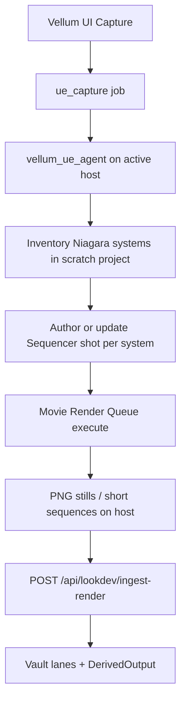

# Unreal lookdev capture (MRQ) — capability spec

**Status:** implemented (scripted batch) / Aurora clean Capture proof (Chrys + pack harden 2026-07-13)  
**Pilot asset:** `fireworks-vol-1-niagara`  
**Primary host:** Aurora (`config/ue-hosts.json` → `active: aurora`)  
**Related:** host runbook `docs/scratch-inspect-niagara.md`, lookdev API `docs/api-lookdev.md`, **hosting SoT** [`docs/ue-lookdev-worker.md`](./ue-lookdev-worker.md)  
**Decisions:** §12 locked 2026-07-13 (B / C / C / C / B)  
**Runner fingerprint:** legacy `mrq-artifact-gate` via interactive agent (`-LegacyCmdRunner`); Lookdev Worker opt-in only  
**Pack harden:** Epic Queue asset via `-MoviePipelineConfig` (multi-job); empty-abort waits; ingest-only resume; `system_name` on renders; curl `-f` + timeouts; job `ok` = full target coverage (not 1/N)

This is **new Vellum functionality**: turn a purchased Unreal Niagara pack into
**full-fidelity lookdev renders** in the vault, driven from the Vellum UI, without
dumping `.uasset` packs into product repos.

It is **not** a screenshot hack, **not** a flipbook-only bake, and **not** an
engine-migration project.

---

## 1. Problem

Slices A–F can stage packs and derive **pack preview textures**. That is not the
same as capturing **how Niagara systems look when simulated**.

We need an operator path:

> Vellum → enqueue capture → Windows UE host runs Unreal as a **renderer** →
> vault gains lookdev outputs under project lanes.

---

## 2. Success (acceptance)

Done when all of the following are true:

1. Operator stays in **Vellum** (Capture control + job progress).
2. Active UE **host profile** runs the job (Aurora primary; Borealis secondary; only one agent polling).
3. Capture uses **Movie Render Queue + Sequencer** (Epic pipeline), not HighResShot / SceneCapture improvisation.
4. Outputs show **real Fireworks Niagara** (distinct systems; not pure black; not a debug cube).
5. Outputs land via existing lookdev ingest into vault lanes (`05-derived-renders/…`, `DerivedOutput` / `niagara-render` or successor kind).
6. Scope is **full lookdev fidelity** as defined in §5 — **not** reduced to flipbook textures to paper over tool limits.

---

## 3. What this capability is / is not

| Is | Is not |
| --- | --- |
| A Vellum **capture backend** behind `ue_capture` jobs | A replacement for vault register / intake |
| Unreal as a **jobbed renderer** (MRQ) | Interactive “take a viewport screenshot” |
| Full scene / VFX lookdev (stills and short image sequences) | Flipbook-only / Niagara Baker scope cut |
| Host-profile aware (Aurora / Borealis) | Tied to one machine’s hardcoded `C:\Program Files\…` |
| Consumer of staged pack content in a scratch `.uproject` | Copying raw packs into Threshold / Hail / LCARD git trees |

---

## 4. Architecture (target)

### Layers

| Layer | Responsibility | Status |
| --- | --- | --- |
| **Control** | UI, `POST /api/ue/capture`, job claim/report/progress | Shipped |
| **Host profile** | `config/ue-hosts.json` — UE path, scratch `.uproject`, content root | Shipped (Aurora active) |
| **Agent shell** | Poll, resolve host, invoke runner, upload, report | Shipped |
| **Inventory** | List / pick Niagara systems under content root | Exists; needs content on Aurora |
| **Capture backend** | Sequencer + MRQ on Lookdev Studio map | Shipped (`mrq-lookdev-studio`) |
| **Ingest** | Multipart lookdev ingest + register derived outputs | Shipped |

Retired backends (do not extend): `-game`+HighResShot; SceneCapture2D export bake.

---

## 5. Capture product definition (full fidelity)

For the Fireworks pilot, each selected Niagara system produces **lookdev media**
(**decision §12.1 = B**):

| Output | Intent |
| --- | --- |
| **Hero still(s)** | One or more peak-frame PNGs (e.g. mid-burst) for lane thumbnails / overlays |
| **Short sequence** | Time-bounded PNG sequence covering the effect’s readable arc; retained in vault |

Resolution default: **1920×1080** (overridable via job payload / env).  
Capture window: **per-system estimate**, capped at **4s @ 30fps** (120 frames) on permanent **Lookdev Studio** map (`/Game/Vellum/Maps/VellumLookdevStudio`); heroes = mid + max-luma.  
Lane ingest on Capture success (**§12.5 = B**): **slots** + **hail-overlay**.

**Out of scope for v1 of this capability (explicit, not a fidelity cut):**

- Real-time game viewport streaming
- Shipping `.uasset` / Niagara assets into product repos
- Unity capture
- Multi-host parallel agents

---

## 6. Prerequisites (operator + project)

Before MRQ can see systems:

1. **Aurora** scratch project exists: `F:\Games\AuroraVellum\AuroraVellum.uproject` (profile).
2. **Fireworks Vol. 1** added to that project (Fab **Add to Project**). Content root expected `/Game/FireworksV1` unless Fab names otherwise — record actual path in host profile / job payload.
3. Plugins enabled in the scratch project (minimum):
   - Python Editor Script Plugin
   - **Movie Render Queue**
   - Sequencer (editor default)
4. Only the **active** host’s `vellum_ue_agent.ps1` is polling.

Evidence of missing content: `job-20260713-181144-c1ce27` → `systems_found=0` / `no_systems_to_bake` with host resolution OK.

---

## 7. Target Unreal workflow (implementation contract)

Exact blueprint/Python asset names are implementation detail; behavior is fixed:

1. **Inventory** — Asset Registry query for `NiagaraSystem` under configured `content_root`; if zero hits, fall back to `/Game` scan and record the winning root (**§12.4 = C**). Default **`max_systems=0` = entire pack** (drop `*_Loop` when a `*_Single` sibling exists). Positive `max_systems` is debug-only.
2. **Per system — stage**
   - Persistent or temp capture level (clean dark stage + lighting suitable for VFX read).
   - Spawn / place the Niagara system; warm up / play for a documented time window.
   - Camera framed on the effect (bounds-aware; documented framing rules).
3. **Per system — Sequencer**
   - Level Sequence spanning the capture window (fixed frame rate, e.g. 30 fps).
   - Tracks: camera cut + Niagara (and any required spawnables).
4. **Per system — MRQ**
   - Movie Pipeline job using a Vellum MRQ preset (PNG; no UI-dependent executor).
   - Output directory under the project `Saved/VellumCapture/mrq/<system>/` (or equivalent).
5. **Select + ingest**
   - Choose hero frame(s) from the sequence (mid + max-luma per **§12.2**).
   - `POST /api/lookdev/ingest-render` per hero into **slots** and **hail-overlay** (**§12.5 = B**); retain PNG sequence in vault (**§12.1 = B**).
6. **Report** job result: `mode=mrq-sequencer`, system count, still counts, errors, `ue_host`.

### Agent / runner fingerprint

New runner mode string (when implemented): `mrq-sequencer`.  
Old fingerprints (`editor-scenecapture*`, `game-mode-capture-map`, etc.) are historical only.

---

## 8. Vellum API / data contracts (account for)

| Surface | Role in this capability |
| --- | --- |
| `POST /api/ue/capture` | Enqueue; payload includes `project_path`, `content_root`, `engine_version`, `ue_host`, `lane`, `force` |
| `POST /api/jobs/claim` | Windows agent |
| `POST /api/jobs/{id}/progress` | Live phase / log tail |
| `POST /api/jobs/{id}/report` | Success/failure + scratch path |
| `GET /api/ue/hosts` | Active host profile for UI defaults |
| `POST /api/lookdev/ingest-render` | Vault write for rendered frames |
| `GET /api/lookdev/outputs` | Operator proof + **skip check** before re-render |

### Skip already-captured systems

After inventory, before Phase B author / MRQ wipe:

1. **Vault covered** — `GET /api/lookdev/outputs` has `niagara-render` for the system on both **slots** and **hail-overlay** → skip render and ingest.
2. **Local MRQ ready** — `Saved/VellumCapture/mrq/<system>/` passes `pick_heroes` (≥30 non-black frames) but vault is incomplete → **ingest only** (no re-render).
3. **Force** — `force: true` on `POST /api/ue/capture`, UI “Force re-render”, runner `-ForceCapture`, or `VELLUM_FORCE_CAPTURE=1` redoes everything. Recover uses `-Force` the same way.

**Inventory cache:** `Saved/VellumCapture/inventory-cache.json` (72h, keyed by `content_root` + `max_systems`). Fresh cache skips the Unreal inventory cold start. If vault covers every cached system, author/MRQ are skipped too — no UE launch.

**Partial pack success:** one black/reject or ingest failure records an error and **continues** remaining systems. Job succeeds when any stills landed (or all vault-skipped).

### Host hardware specs

Windows agent POSTs a CIM snapshot to `POST /api/ue/hosts/specs` on startup (`report_host_specs.ps1`). Surfaced on `GET /api/ue/hosts` as `host_specs` so Capture planning can see real CPU/GPU/RAM instead of treating Aurora as a black box.

**Likely follow-ons** (track when implementing; do not silently invent):

- Job payload fields: `capture_backend: "mrq_sequencer"`, `frame_rate`, `duration_sec`, `max_systems`, `output_kind: stills|sequence|both`
- DerivedOutput `kind` values beyond `niagara-render` if sequences need a distinct kind
- Progress messages that distinguish inventory / sequence author / MRQ / ingest phases

### Lookdev Studio (photo stage)

Permanent map `/Game/Vellum/Maps/VellumLookdevStudio` — floor, pedestal, center slot (`VellumStudio_Slot_Center`), lights, mid camera. Built once (Phase 0 / `vellum_lookdev_studio_author.py`); `studio-ready.json` skips rebuild unless `ForceStudio` / `VELLUM_FORCE_STUDIO=1`.

Capture places each Niagara system at the slot and uses the studio camera. Capture length is **estimated per system** (finished probe / duration user param), clamped to **24–120 frames @ 30fps**. Prior void-space stills remain in the vault but **do not match** studio lighting/framing — use **Force** for a pack refresh after this lands.

---

## 9. Host profiles

Canonical file: [`config/ue-hosts.json`](../config/ue-hosts.json).

| id | role | notes |
| --- | --- | --- |
| `aurora` | primary / **active** | `F:\Games\UE_5.8\…`, project `F:\Games\AuroraVellum` |
| `borealis` | secondary | Epic Launcher default paths; do not debug capture quality here unless operator reopens |

Switching hosts = flip `active` (and restart the single polling agent). Capture backend must be host-agnostic aside from paths in the profile.

---

## 10. Failure modes (honest)

| Symptom | Meaning |
| --- | --- |
| `systems_found=0` | Pack not in scratch project / wrong `content_root` |
| MRQ plugin missing | Enable Movie Render Queue; fail job with clear error |
| Black / empty frames | Treat as **failure** (do not mark lookdev success) |
| Agent 409 on report | Double-report bug in agent catch path — fix when touching agent; not a capture-backend issue |

---

## 11. Implementation sequence

Operator UI work is limited to: Fab Add-to-Project, enable plugins, run agent / Capture in Vellum. **No** hand Sequencer/MRQ clicking.

1. Confirm Fireworks present under Aurora scratch (`/Game/FireworksV1`) + MRQ/Python plugins — **done 2026-07-13**.
2. Implement scripted capture: inventory → stage → Sequencer assets → MRQ (cmdline) → heroes + sequence → ingest (**slots** + **hail-overlay**).
3. First proof run via agent/`ue_capture` on Aurora (one system OK for first green); then default `max_systems`.
4. Vellum UI/docs point at this capability (not SceneCapture).
5. Proof: ≥1 Fireworks system with distinct non-black lookdev in vault lanes.

---

## 12. Decisions (locked 2026-07-13)

1. **v1 outputs:** **B — locked.** Hero stills **and** retained short PNG sequence in vault.
2. **Duration / framing:** **C — locked.** Bounded adaptive capture: fixed max window (default **4s / 120 frames @ 30fps**); camera from system bounds after warmup; hero stills = mid-sequence frame + max-luma frame from the rendered sequence.
3. **MRQ executor:** **C — locked.** Production path = **new-process / command-line MRQ** (`UnrealEditor-Cmd` + saved sequence/preset). Proof spike is **scripted/unattended** (operator does **not** hand-author Sequencer/MRQ in the UE UI).
4. **Content root discovery:** **C — locked.** Try configured `content_root` (default `/Game/FireworksV1`) first; if zero Niagara systems, scan `/Game`, record the path that worked in the job/manifest, and proceed.
5. **Multi-lane ingest:** **B — locked.** On Capture success, ingest heroes (+ sequence retention) to **slots** and **hail-overlay** (same pair as Fireworks texture derive). Other lanes stay explicit/opt-in.

---

## 13. Doc index

| Doc | Topic |
| --- | --- |
| **This file** | Capability SoT for MRQ lookdev capture |
| `docs/scratch-inspect-niagara.md` | Host profiles + operator agent commands; retired backends |
| `config/ue-hosts.json` | Aurora / Borealis paths |
| `docs/api-lookdev.md` | Ingest / derive APIs |
| `docs/slice-e-epic-staging.md` | Fab Add-to-Project → vault stage |
| `DEV_TRACKER.md` | Active issue pointer |
