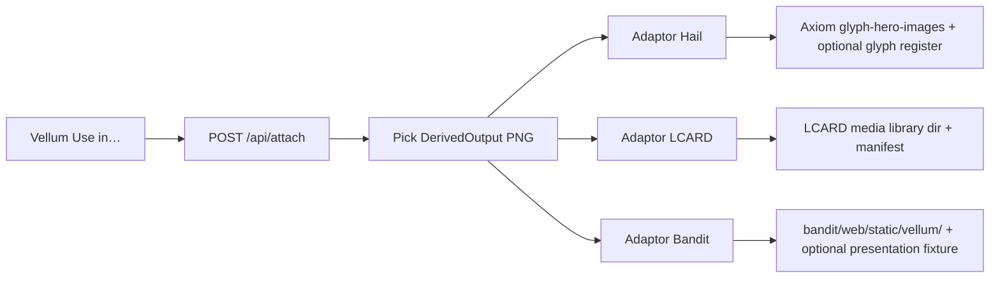

# Use / Attach — vault lookdev → product surfaces

**Status:** implemented (2026-07-14) — `POST /api/attach` Hail / LCARD / Bandit  
**Owner product:** Vellum (`id: vellum`)  
**Problem:** Vellum writes lookdev PNGs under `/mnt/data/vault/vellum`. Bandit, LCARD, and Hail do **not** read that path. Operator cannot “use” packs without Attach.

## Reality (validated 2026-07-14)

| Surface | Exists | Loads art from today |
| --- | --- | --- |
| Vellum | Yes (`:8770` + vault) | Producer only |
| Hail authoring | Axiom Hails / Paintbox | `config/hails/glyph-hero-images/` → package `representation_kind: image` / `image_layers` → APK gets base64 in overlay payload |
| LCARD | `control-alt-lcard` | `app/media/vellum/` via Attach (not vault mount) |
| Bandit | `bandit` `:8766` | `web/static/vellum/` + `/vellum-preview` via Attach |
| Bridge | **Attach** (`POST /api/attach`) | Copies stills into each consumer’s existing load path |

Existing Hail promote helper (pattern to call, not reinvent):  
`ctrl-alt-axiom/scripts/promote-raster-glyph-hero.py`

## Product goal (non–game-dev)

Operator in Vellum:

1. Opens a **Ready** pack / derived still.
2. Clicks **Use in…** → Hail | LCARD | Bandit.
3. Sees it on that product’s real surface (Paintbox TV preview, LCARD card slot, Bandit overlay fixture).

No Unreal, no VaultCache ritual, no copying raw `.uasset` into product git.

## System name

**Attach** (Vellum slice). One inbox UI, **three adaptors**.



## Objects

### `DerivedOutput` (already exists)

Vault-backed still / niagara-render / sequence hero. Source of truth for bytes.

### `Attachment` (new, Vellum registry)

```json
{
  "id": "attach-…",
  "derived_output_id": "derived-…",
  "asset_id": "portal-vfx-enhanced",
  "target": "hail | lcard | bandit",
  "target_ref": "product-specific id or path",
  "status": "attached | failed",
  "created_at": "…"
}
```

Audit only. Products do **not** call back into Vellum at runtime (except optional signed URL later).

## API (Vellum)

| Method | Path | Purpose |
| --- | --- | --- |
| `GET` | `/api/attach/targets` | `{ hail, lcard, bandit }` with adaptor health + “where it will land” |
| `POST` | `/api/attach` | Body: `{ derived_output_id, target, options? }` → run adaptor → write `Attachment` |
| `GET` | `/api/attach?asset_id=` | List attachments for UI |
| `GET` | `/api/lookdev/outputs/{id}/file` | Already exists — adaptors read bytes via vault path (same host) |

**Auth / safety:** Attach runs on the hub that already mounts the vault. No product container needs the vault mount for v1 if Vellum copies files out to product trees (bind paths on operator host).

## Adaptors (v1 — build in this order)

### 1. Hail (highest value; path already real)

**Land:** copy PNG →  
`/mnt/temp/config/ctrl-alt-axiom/config/hails/glyph-hero-images/vellum-<asset_id>-<shortid>.png`

**Then (options):**
- `register_glyph: true` (default) — create/update a glyph with `representation_kind: image` pointing at that file (reuse Axiom hail register APIs / promote script behavior).
- Operator opens `#/axiom/hails/forge`, picks glyph, sends Hail as today.

**Success:** Paintbox derive-preview shows the Vellum still; APK path unchanged (base64 enrich already exists).

**Do not:** mount vault into APK; do not invent a second image store.

### 2. LCARD (needs a tiny library that does not exist yet)

**Land:** create once:  
`/mnt/temp/config/control-alt-lcard/media/vellum/` + `media/manifest.json`

**Attach:** copy PNG there; append manifest row `{ id, title, path, asset_id, attached_at }`.

**Then:** one LCARD companion page/list: “Vellum media” — pick image for card / send-as-Hail-attachment if LCARD already forwards images to Hail.

**Success:** operator sees the still in LCARD UI and can place it on a card or forward to Hail without leaving the Games stack.

### 3. Bandit (lowest coupling)

**Land:**  
`/mnt/temp/config/bandit/web/static/vellum/<asset_id>/hero.png`

**Then:** optional `web/fixtures/presentation-payloads/vellum-<asset>.json` that references `/static/vellum/...` so `/overlay` can show it in a **dev/attach preview** mode.

**Success:** open Bandit overlay URL with fixture or a simple `/vellum-preview` page that shows the PNG. Full reel re-art is later.

## UI (Vellum)

On asset detail / lookdev gallery:

- Thumbnail strip of `DerivedOutput`s (slots + hail-overlay first).
- Buttons: **Use in Hail** | **Use in LCARD** | **Use in Bandit**
- After attach: deep link
  - Hail → `#/axiom/hails/forge?glyph=…`
  - LCARD → companion media route
  - Bandit → overlay/preview URL

## Non-goals (v1)

- Shipping raw Unreal `.uasset` into any product repo
- Unity
- Multi-machine farm
- Hail reading vault at runtime
- Operator becoming an Unreal game developer

## Build order

1. `POST /api/attach` + Hail adaptor + Vellum button (prove TV path).
2. LCARD media folder + companion list.
3. Bandit static preview.
4. CFD / tracker: “Attach Ready lookdev → Hail visible in Paintbox.”

## Success test (operator)

1. Vellum → Ready pack with hail-overlay still.  
2. **Use in Hail**.  
3. Forge shows new image glyph without manual file copy.  
4. Send Hail → TV/overlay shows that art.

If step 3–4 fail, Attach is not done — vault lookdev alone does not count.

## Proof (2026-07-14)

1. Attached Ready still `derived-20260714-044538-4ae343` (`magic-cast-vfx`, hail-overlay) → Hail.
2. Landed PNG: `config/hails/glyph-hero-images/vellum-magic-cast-vfx-17f7a6.png`.
3. Registered `custom-vellum-magic-cast-vfx-17f7a6` (`representation_kind: image`); `GET /api/hails/glyph-images/….png` → 200; derive-preview `glyph_render.kind=image`.
4. Hail Forge lists **magic-cast-vfx (Vellum)** and Paintbox shows the raster.
5. Attachment row: `GET /api/attach?target=hail`.

**Ops note:** Axiom must run an image that supports raster Glyph Heroes (`ctrl-alt-axiom:local` or newer GHCR). The 2026-06 `:main` pull rejects image glyphs as `emoji_fallback` during companion materialize.
